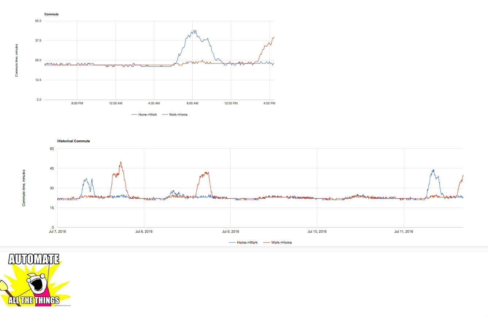

Description
===========

Displays historical and real time commute time between two predefined locations. Typically home and work.
Uses cron and Google Maps API. You need to get your own google developer token to make it work. You need to have your own
server to deploy it to.

How it looks
---

How it works
---
There are two parts:

1. cron job that collects datapoints at predefined intervals, these are appended to a CSV file. See 'travel-time.sh'
2. a static html page that renders the data. See 'index.html'

Deployment
===

Pre-requisites
---
Install [jsawk](https://github.com/micha/jsawk), note that you will also need an 'js' executable.
Examples:
* On Mac - `brew install spidermonkey`
* On ubuntu - `sudo apt-get install libmozjs-24-bin`

Installation
------------
1. Clone or download the repo.
1. Set up a cron job

`cron tab`
`*/5 * * * *  /home/ubuntu/travel-time.sh >> /home/ubuntu/travel-time.log.csv 2>&1`

1. Make sure all permissions are fine
1. Deploy any webserver
1. Place index.html somewhere it cab be served
1. Create `travel-time.personal.sh` and hardcode your addresses and api key. Place it in the same folder with 'travel-time.sh'
1. Symlink `travel-time.log.csv` to where you put `index.html`
1. Wait till some data is generated and load the index.html in your browser
